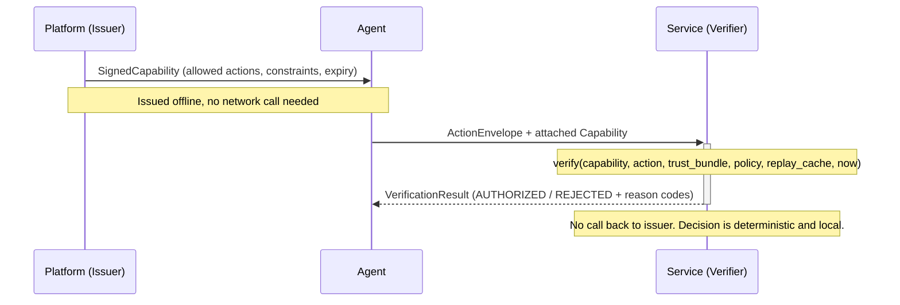

# Anchor Protocol

[](https://github.com/GustyCube/anchor/actions/workflows/ci.yml)
[](LICENSE)
[](spec/)
[](go.mod)
[](https://goreportcard.com/report/github.com/gustycube/anchor)
[](https://pkg.go.dev/github.com/gustycube/anchor)
[](https://bestpractices.coreinfrastructure.org/projects/gustycube-anchor)
[](conformance/)
[](docs/COMPATIBILITY_MATRIX.md)
[](SECURITY.md)
[](CONTRIBUTING.md)

Open protocol for deterministic, offline verification of AI agent authorization.

---

## The problem

When an AI agent takes an action on behalf of a user -- calling an API, writing to a database, triggering a workflow -- the service receiving that action has no standard way to verify the agent was actually authorized to do it. Most systems either trust the agent implicitly or call back to a centralized authorization API at runtime.

Neither approach works well at scale. Implicit trust has no auditability. Centralized auth introduces latency, a network dependency, and a single point of failure.

Anchor solves this with a signed artifact model: the platform that grants the agent its permissions signs a **Capability** up front. The agent attaches that Capability to every action it takes. The service verifies the signature and checks the scope locally, with no network call required. The decision is deterministic and fully auditable.



---

## Core guarantees

- **Offline verifiability.** Verification never requires a network call. Cached trust bundles are sufficient.
- **Deterministic outcomes.** Identical inputs and trust policy always produce identical decisions.
- **Machine-readable reason codes.** All rejection paths produce stable, registered reason codes for audit pipelines.
- **No runtime dependency on the issuer.** Once a Capability is signed and distributed, the issuer does not need to be reachable at decision time.

> [!IMPORTANT]
> Local verification is and will remain free. There is no payment or network dependency required to run the verifier.

---

## How it works

Anchor defines three normative objects and one verification function.

**Capability** -- signed by the issuer, scoped to a specific agent, audience, set of allowed actions, and constraint set (resource limits, spend limits, rate limits, environment, API scope). Short-lived by design.

**ActionEnvelope** -- signed by the agent, bound to a specific Capability, carrying the action type, payload, and constraint evidence for the current request.

**TrustBundle** -- a signed list of trusted issuer public keys with validity windows. Verifiers resolve issuer keys from a locally cached bundle, with optional network refresh.

**Verification function:**

```
verify(capability, action, trust_bundle, local_policy, replay_cache, now) -> VerificationResult
```

The verifier runs 14 deterministic checks -- signature validity, validity windows, audience binding, action scope, constraint evidence, delegation depth, replay detection, policy hash integrity, and optional policy hooks -- and returns a structured result with `decision`, `reason_codes`, and `replay_status`.

<details>
<summary>Full list of mandatory checks</summary>

1. Capability signature verification
2. Action signature verification
3. Issuer key resolution from local trust material (`issuer_id` + `issuer_kid`)
4. Capability validity window (`issued_at`, `expires_at`)
5. Audience equality checks
6. Delegation depth bounded by `max_depth`
7. Allowed action scope
8. Constraint evidence checks (resource, spend, rate limits)
9. Replay detection
10. Policy hash integrity when expected policy is configured
11. Challenge nonce enforcement for high-risk action classes
12. Issuer key validity-window checks from trust bundle
13. Optional transparency reference linkage
14. Optional local policy-hook evaluation

</details>

---

## Quick start

**Prerequisites:** Go 1.24.6+, Git

```bash
git clone https://github.com/GustyCube/anchor.git
cd anchor

# Run all protocol and conformance tests
go test ./...

# Run the local verification example (payments agent flow)
go run ./examples/local-verify

# Run the trust bundle fallback example
go run ./examples/trust-bundle-fallback
```

### Verifying an action in Go

```go
import (
    anchorcrypto "github.com/GustyCube/anchor/core/crypto"
    protocolgo "github.com/GustyCube/anchor/sdk/go"
)

// Build and sign a capability (issuer side)
capability := protocolgo.Capability{
    Version:        protocolgo.Version,
    IssuerID:       issuerID,
    IssuerKID:      "k1",
    AgentID:        agentID,
    Audience:       "payments-api",
    AllowedActions: []string{"payments.transfer.create"},
    Constraints: protocolgo.ConstraintSet{
        ResourceLimits:         map[string]int64{"tokens": 5000},
        SpendLimits:            map[string]int64{"usd_cents": 200000},
        APIScopes:              []string{"payments:write"},
        RateLimits:             map[string]int64{"per_minute": 120},
        EnvironmentConstraints: []string{"prod"},
    },
    PolicyHash: "sha256:payments-policy-v1",
    IssuedAt:   time.Now(),
    ExpiresAt:  time.Now().Add(1 * time.Hour),
    Nonce:      "cap-unique-nonce",
    Delegation: protocolgo.Delegation{Depth: 0, MaxDepth: 1},
}
protocolgo.SignCapability(&capability, issuerPrivateKey)

// Build and sign an action (agent side)
action := protocolgo.ActionEnvelope{
    AgentID:      agentID,
    CapabilityID: capability.CapabilityID,
    Audience:     "payments-api",
    ActionType:   "payments.transfer.create",
    ActionPayload: json.RawMessage(`{"amount_cents":2500,"currency":"USD"}`),
    ConstraintEvidence: protocolgo.ConstraintEvidence{
        ResourceUsage: map[string]int64{"tokens": 900},
        SpendUsage:    map[string]int64{"usd_cents": 2500},
        RateUsage:     map[string]int64{"per_minute": 1},
        Environment:   "prod",
        APIScope:      "payments:write",
    },
    Timestamp: time.Now(),
}
protocolgo.SignAction(&action, agentPrivateKey)

// Verify (service side, no network call)
result := protocolgo.OfflineVerify(protocolgo.OfflineVerifyInput{
    Capability:         capability,
    Action:             action,
    AgentPublicKey:     agentPublicKey,
    ReferenceTime:      time.Now(),
    ExpectedAudience:   "payments-api",
    ExpectedPolicyHash: "sha256:payments-policy-v1",
    KeyResolver:        protocolgo.TrustBundleKeyResolver{Bundle: trustBundle},
    ReplayCache:        protocolgo.NewInMemoryWindowReplayCache(),
})

if result.Decision == protocolgo.DecisionAuthorized {
    // proceed
}
```

> [!TIP]
> See [`examples/local-verify/main.go`](examples/local-verify/main.go) for a complete runnable flow including trust bundle signing, replay rejection, audience mismatch, and challenge enforcement.

---

## SDK status

All four SDKs implement the full offline verifier surface with pluggable crypto providers. Reason code parity is enforced by the conformance suite on every commit.

| SDK | Path | Offline verifier | Reason-code parity gate |
| --- | --- | --- | --- |
| Go | `sdk/go` | Native | Yes |
| TypeScript | `sdk/typescript` | Yes | Yes |
| Python | `sdk/python` | Yes | Yes |
| Java | `sdk/java` | Yes | Yes |

<details>
<summary>TypeScript example</summary>

```typescript
import { AnchorOfflineVerifier } from "./sdk/typescript/verifier.ts";

const verifier = new AnchorOfflineVerifier();
const result = verifier.verify({
  capability,
  action,
  agentPublicKey: "...",
  referenceTime: new Date(),
  expectedAudience: "payments-api",
  expectedPolicyHash: "sha256:payments-policy-v1",
  keyResolver,
  replayCache,
  crypto: myCryptoProvider,
});
```

</details>

<details>
<summary>Python example</summary>

```python
from sdk.python.verifier import AnchorOfflineVerifier, VerifyRequest

verifier = AnchorOfflineVerifier()
result = verifier.verify(VerifyRequest(
    capability=capability,
    action=action,
    agent_public_key="...",
    reference_time=datetime.now(timezone.utc),
    expected_audience="payments-api",
    expected_policy_hash="sha256:payments-policy-v1",
    key_resolver=key_resolver,
    replay_cache=replay_cache,
    crypto=my_crypto_provider,
))
```

</details>

<details>
<summary>Java example</summary>

```java
AnchorLocalVerifier verifier = new AnchorLocalVerifier();
VerifyRequest request = new VerifyRequest();
request.capability = capability;
request.action = action;
request.agentPublicKey = "...";
request.referenceTime = Instant.now();
request.expectedAudience = "payments-api";
request.expectedPolicyHash = "sha256:payments-policy-v1";
request.keyResolver = keyResolver;
request.replayCache = replayCache;
request.cryptoProvider = myCryptoProvider;

VerificationResult result = verifier.verify(request);
```

</details>

---

## Conformance

The conformance suite enforces protocol correctness across all implementations.

```bash
# Core vector suite
go test ./conformance/...

# SDK behavior parity (requires Node, Python 3.12+, Java 21+)
go test ./conformance/tests -run TestSDKBehaviorParityAcrossRuntimes

# Reason code registry parity
go test ./conformance/tests -run TestReasonCodeRegistryParityAcrossSDKSources
```

The multi-system scenario suite covers realistic end-to-end flows including cloud infrastructure, financial transfers, social publishing with content policy hooks, healthcare EHR updates, logistics with sanctions checks, and high-risk challenge enforcement.

> [!NOTE]
> A conformant implementation must match `decision` and `reason_codes` for all official vectors. Reason code ordering and replay status semantics are defined by the Go reference engine.

---

## Protocol artifacts

| Artifact | Path |
| --- | --- |
| Capability schema (v2) | `spec/schemas/capability-v2.schema.json` |
| ActionEnvelope schema (v2) | `spec/schemas/action-envelope-v2.schema.json` |
| TrustBundle schema (v1) | `spec/schemas/trust-bundle-v1.schema.json` |
| Reason code registry (v2) | `spec/reason-codes/reason-codes-v2.json` |

---

## Repository structure

```
core/         Canonicalization, hashing, signing, verification logic
spec/         JSON schemas and reason-code registry
sdk/          Go, TypeScript, Python, and Java SDK surface
conformance/  Vectors, fixtures, and cross-SDK parity tests
examples/     Runnable local verification examples
docs/         Normative spec, threat model, trust model, governance
```

---

## Documentation

| Document | Description |
| --- | --- |
| [SPEC.md](docs/SPEC.md) | Normative protocol specification |
| [THREAT_MODEL.md](docs/THREAT_MODEL.md) | Threat model and mitigations |
| [TRUST_MODEL.md](docs/TRUST_MODEL.md) | Trust sources and offline operation model |
| [INTEGRATION_PATTERNS.md](docs/INTEGRATION_PATTERNS.md) | Gateway enforcement and local verifier patterns |
| [SECURITY_BEST_PRACTICES.md](docs/SECURITY_BEST_PRACTICES.md) | Key management, TTLs, challenge mode |
| [PROOF_SKETCH.md](docs/PROOF_SKETCH.md) | Formal invariants and verification predicates |
| [VERSIONING.md](docs/VERSIONING.md) | Semantic versioning and compatibility policy |
| [COMPATIBILITY_MATRIX.md](docs/COMPATIBILITY_MATRIX.md) | SDK compatibility matrix |
| [MIGRATION_V1_TO_V2.md](docs/MIGRATION_V1_TO_V2.md) | Migration guide from v1 |
| [GOVERNANCE.md](docs/GOVERNANCE.md) | RFC process and change governance |

---

## Security

> [!CAUTION]
> Do not open public issues for vulnerability reports. Follow the private disclosure process.

Report vulnerabilities to `security@gustycube.com`. See [SECURITY.md](SECURITY.md) and [docs/SECURITY_DISCLOSURE.md](docs/SECURITY_DISCLOSURE.md) for response targets and disclosure policy.

---

## Release and compatibility policy

Protocol and SDK artifacts use semantic versioning. Breaking protocol changes require an explicit major version increment, migration guidance, and conformance vector updates before release.

See [docs/VERSIONING.md](docs/VERSIONING.md) and [docs/COMPATIBILITY_MATRIX.md](docs/COMPATIBILITY_MATRIX.md).

---

## Contributing

Contributions are welcome. Start with [CONTRIBUTING.md](CONTRIBUTING.md). Conformance-sensitive changes in `core/`, `spec/`, `sdk/`, and `conformance/` require extra review. See [CODE_OF_CONDUCT.md](CODE_OF_CONDUCT.md) and [SUPPORT.md](SUPPORT.md).

---

## License

Apache-2.0. See [LICENSE](LICENSE).
